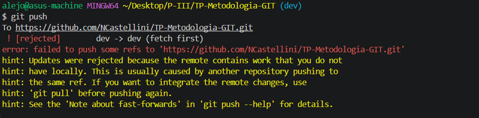
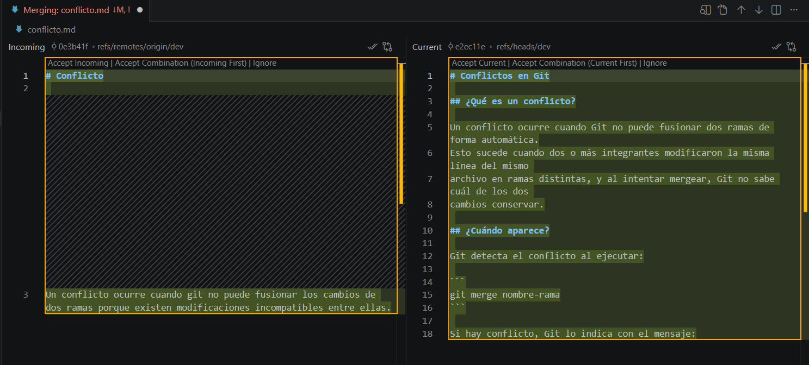
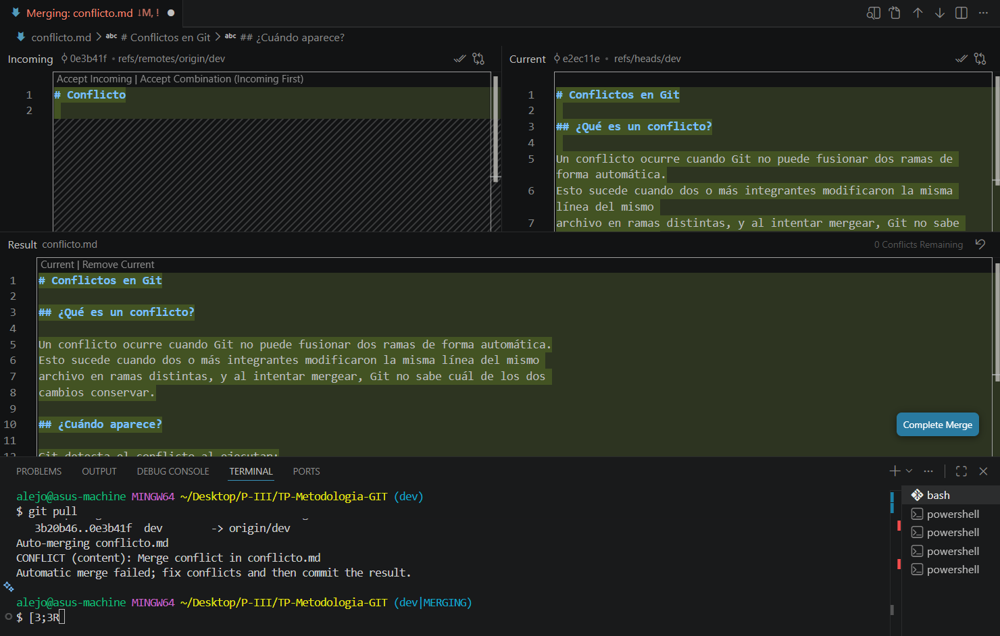

# Conflictos en Git

## ¿Qué es un conflicto?

Un conflicto ocurre cuando Git no puede fusionar dos ramas de forma automática.
Esto sucede cuando dos o más integrantes modificaron la misma línea del mismo 
archivo en ramas distintas, y al intentar mergear, Git no sabe cuál de los dos 
cambios conservar.

## ¿Cuándo aparece?
Git detecta el conflicto al ejecutar:
```
git merge nombre-rama
```

Si hay conflicto, Git lo indica con el mensaje:
```
CONFLICT (content): Merge conflict in archivo.md
    Automatic merge failed; fix conflicts and then commit the result.
```

## ¿Cómo se ve en el archivo?
Git marca las dos versiones en conflicto dentro del archivo afectado:
```
    <<<<<<< HEAD
    Contenido de la rama actual.
    =======
    Contenido de la rama que se quiere mergear.
    >>>>>>> nombre-rama
```
- Todo lo que está entre `<<<<<<< HEAD` y `=======` es el contenido de la rama actual.
- Todo lo que está entre `=======` y `>>>>>>>` es el contenido de la rama entrante.

## ¿Cómo se resuelve?
1. Abrimos el archivo con el conflicto.
2. Elegimos que versión conservar, o combinamos ambas.
3. Guardamos el archivo y lo agregamos al stage: `git add archivo.md`.
4. Finalizamos con un commit descriptivo: `git commit -m "fix: resuelve conflicto en archivo.md"`


## En nuestro Repositorio
Al hacer push salta el error:
  


Entonces traemos los conflictos con git pull.
  


Elegimos que modificación hacer:
  


Guardamos el archivo, y finalizamos con un commit para el merge:
```
git commit -m"Merge branch 'dev' of https://github.com/NCastellini/TP-Metodologia-GIT into dev"
```