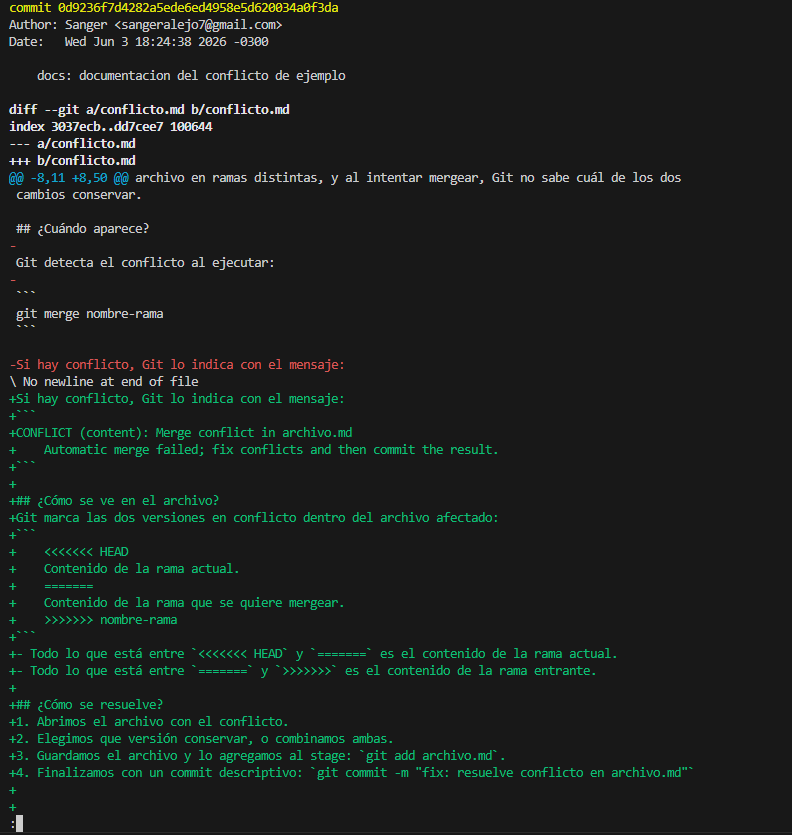

### Commit con mayor cantidad de archivos modificados

Hash: e96bd775558400e5ba387ad0332a21b3a83f1074

Cantidad de archivos modificados: 16

Comando utilizado:

```bash
git log --stat
```

### Observacion

```
Si bien este es el commit con mayor cantidad de archivos modificados, el commit 0d9236f7d4282a5ede6ed4958e5d620034a0f3da presenta un diff más representativo, ya que incluye modificaciones de contenido sobre 4 archivos:

```
### Captura: 




### Cantidad de comandos realizados:
comando utilizado: (git log --oneline --merges).Count
resultado 9

### Cantidad de commits (al momento de hacer esto ya que despues van a aumentar)
comando utilizado: git shortlog -sn --all
resultado:
    24  Nicolas Castellini
    17  Sanger
    18  Negrete nazareno

### cantidad de Ramas:
1- main
2- dev
3- Negrete_Rama
4- NCastellini
5- alumno_sanger


### Alumno con mas commits:
Nicolas Castellini con 24 commits (al dia de hacer esto)

